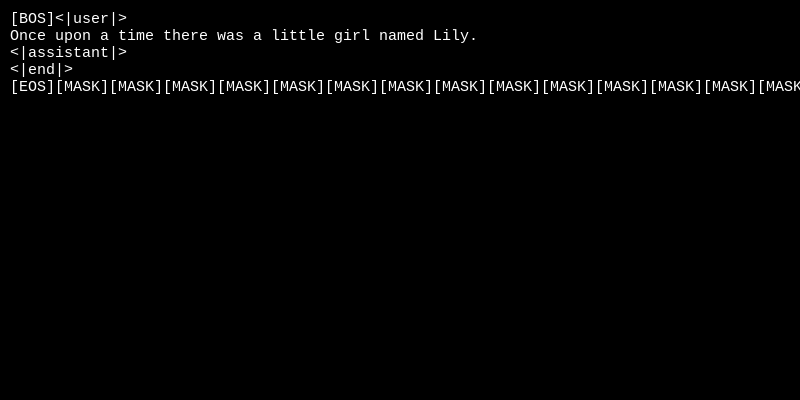

## Diffusion Language Model

- Classical Large Language Models (LLMs) are a class of models aiming to learn the distribution of text $p_{data}$, and predominantly, they rely during training on the autoregressive modeling paradigm (ARM), meaning that they are pre-trained on a simple next-token prediction task. Once trained, and given an input text or prompt, they simply predict the next most likely token, then append it to the input text to run again the same prediction step, and they repeat this process until the complete model response is completed.

- This left-to-right paradigm has shown to be remarkably effective. However, it still showed certain reasoning limitations, for instance if a model is trained on a sentence of the form **“A is B”**, it will not automatically generalize to the reverse direction **“B is A”** [as shown in this paper](https://proceedings.iclr.cc/paper_files/paper/2024/file/5178b2f2d7c44aa390c0777dc77b3f0c-Paper-Conference.pdf).


- Moreover, inference can be time-consuming, as each token is generated sequentially, one at a time. Therefore, the **autoregressive** paradigm can be challenged.

- We present here an alternative for training language models that is inspired by extending  **diffusion** models to text, following the same principles used in current SOTA image generation models (Stable Diffusion, DALL-E...).


## Inference Visualization

A minimal animation shows the final diffusion language model generating an output response based on user input query.



## Repository Structure

The primary files in this codebase are :

1. ```model.py```: defines the model architecture
2. ```tokenizer_train.py```: the tokenizer training pipeline
3. ```prepare_dataset.py``` : the pipeline for preprocessing data before training
4. ```train.py```: the training phase for the diffusion language model
5. ```inference.py```: the inference pipeline
6. ```checkpoints/``` : folder containing both the final tokenizer files as well as the trained model weights   

Additionally, a folder ```notebooks/``` contains some notebooks to gain a hands-on understanding of the different steps.

## Overview of Diffusion Language Models
- A diffusion Large Language Model (dLLM) produces an output response by iteratively **denoising the whole sequence**, where it simulates a reverse diffusion process from a fully masked sequence in the following :

  1.   Starts with a sequence of noise (contains only the `[MASK]` token)
  2.   Predicts tokens of the masked positions
  3.   Apply a remasking strategy, like keeping the most probable ones, and re-mask the others
  4.   Repeat the same process until no mask token is remained

- Its main practical advantage is that the entire sequence is generated in parallel at each iteration and then progressively refined through a fixed number of denoising steps, rather than being produced token-by-token as in autoregressive language models

We go over the main ingredients for training dLLMs :


#### Training Phase

- The forward (*corruption*) process starts by taking a token sequence and replaces a subset of its tokens with a special `[MASK]` token, which represents noise. The model it then trained to predicts the original tokens from the corrupted input sequence using a cross entropy loss.

- The corruption process is done following a *Bernouilli Process*, where each token has a probability $p(t)$ of being replaced with the `[MASK]` token which is controlled by a diffusion timestep $t$.

- At each training step, a diffusion timestep $t \sim \mathcal{U}[0, T]$ is sampled, where $T$ is the number diffusion steps, and use it on the input sequence to determine the ratio of masked tokens. The model sees this corrupted sequence and predicts the original tokens at the masked positions.

- In terms of model architecture, we use a decoder-only transformer with some additional changes 
  *   In addition to the input embeddings and the positional embedding, we also add a learnable **time-step embedding** as well which encodes the noise level given the diffusion timestep $t$.
  *   We replace the Causal Attention mask by a bi-directional attention one to use tokens before and after the masked when computing the attention scores of the sequence.


####  Inference Phase


- The reverse (*denoising*) process goes across multiple timesteps, starting at timestep $t=T$ where all tokens are set to `[MASK]` token, until timestep $t=1$ which produces the final output sequence. 

Various strategies can be used to predict tokens at each step, like [MaskGIT](https://arxiv.org/abs/2202.04200) from which we take inspiration as follows :

  - Initialize the sequence as fully masked
  - At each iteration, predict token distributions (logits) for all masked positions and sample tokens using this distribution over the vocabulary.
  - Apply a remasking strategy, by remasking the $k$ tokens with low probability prediction.
  - Repeat iteratively the same process from the partially denoised sequence until no `[MASK]` token is left


## Training Dataset

We train our dLLM on [TinyStories dataset](https://huggingface.co/datasets/roneneldan/TinyStories) which consists of a number of synthetic small stories that a typical 3-year-old child would understand, which is in general a very **restricted and small** vocabulary. We also train a tokenizer from scratch from this dataset before training the model itself

